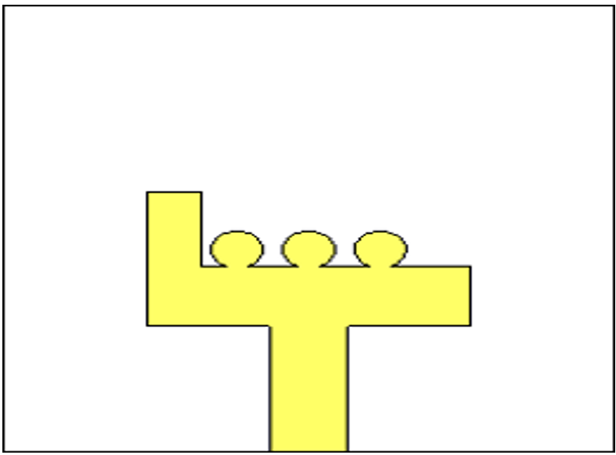
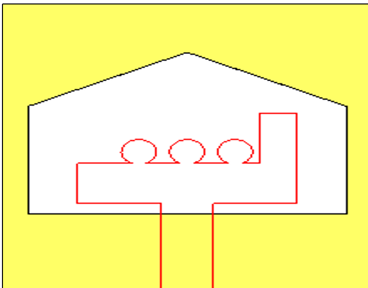
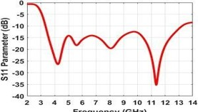
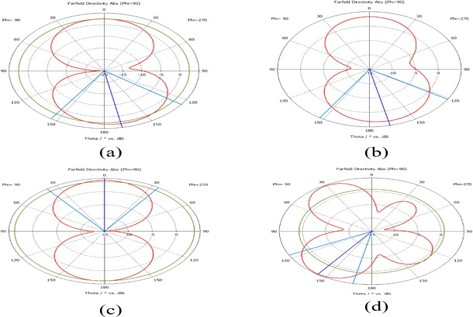
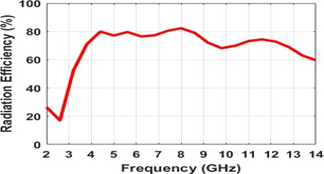
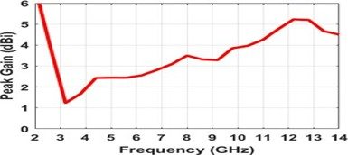
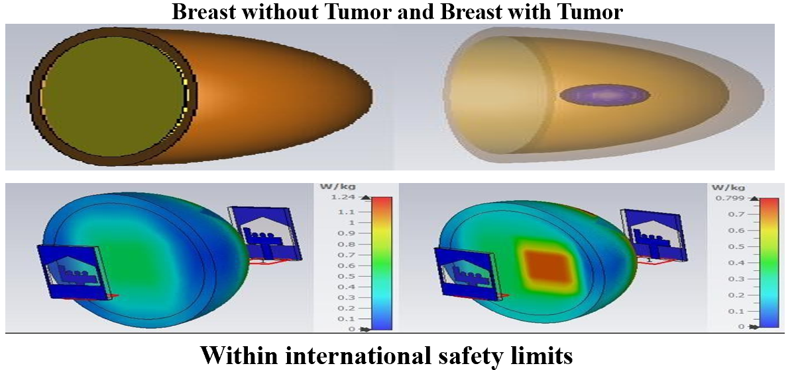

#  Design and Performance Evaluation of a Compact UWB Antenna for Breast Tumor Detection

##  Overview

This project presents the design and performance evaluation of a compact Ultra-Wideband (UWB) microstrip antenna for breast tumor detection. The antenna was designed and simulated using **CST Studio Suite** for microwave imaging applications, providing a safe and non-invasive approach for early breast cancer detection.

---

##  Objectives

- Design a compact UWB microstrip antenna.
- Improve early breast tumor detection using microwave imaging.
- Reduce radiation exposure compared to conventional imaging techniques.
- Evaluate antenna performance through simulation.
- Analyze patient safety using SAR.

---

##  Key Features

- Compact UWB Microstrip Antenna Design
- Wideband Operation for Microwave Imaging
- S11 (Return Loss) Analysis
- Radiation Pattern Evaluation
- Peak Gain Analysis
- Radiation Efficiency Analysis
- SAR Analysis within Safety Limits
- Breast Phantom Simulation

---

##  Technologies Used

- **Simulation Software:** CST Studio Suite
- **Antenna Type:** Compact UWB Microstrip Antenna
- **Analysis:** S11, Radiation Pattern, Peak Gain, Radiation Efficiency, SAR
- **Application:** Breast Tumor Detection using Microwave Imaging

## 📷 Proposed Antenna Design

  
  

---

## ⚙️ Working Principle

The proposed Ultra-Wideband (UWB) microstrip antenna is designed to transmit and receive microwave signals for breast tumor detection. Due to the difference in dielectric properties between healthy and cancerous tissues, the reflected electromagnetic waves vary in intensity. These variations can be analyzed to identify the presence of a tumor. The antenna's performance is evaluated through CST Studio Suite using parameters such as S11 (Return Loss), Radiation Pattern, Peak Gain, Radiation Efficiency, and Specific Absorption Rate (SAR).

---

## 📊 Simulation Results

- **S11 (Return Loss):** Demonstrates excellent impedance matching across the Ultra-Wideband frequency range.
- **Radiation Pattern:** Provides stable omnidirectional radiation characteristics suitable for microwave imaging.
- **Peak Gain:** Achieves sufficient gain for reliable signal transmission and reception.
- **Radiation Efficiency:** Maintains high efficiency throughout the operating frequency band.
- **SAR Analysis:** Confirms that electromagnetic radiation levels remain within international safety standards.

---

## 📈 Performance Parameters

| Parameter | Description |
|-----------|-------------|
| **S11 (Return Loss)** | Evaluates impedance matching and operating bandwidth. |
| **Radiation Pattern** | Illustrates the antenna's radiation characteristics. |
| **Peak Gain** | Measures the antenna's maximum signal strength. |
| **Radiation Efficiency** | Indicates how effectively the antenna radiates power. |
| **SAR Analysis** | Verifies electromagnetic radiation is within international safety limits. |

---

## 🚀 Future Scope

- Fabricate and experimentally validate the antenna prototype.
- Integrate the antenna into portable microwave breast imaging systems.
- Enhance detection accuracy using AI and machine learning techniques.
- Improve antenna performance for higher-resolution medical imaging.
- Extend the design for other biomedical imaging applications.

## 📈 S11 (Return Loss)

---

## 📡 Radiation Pattern

---

## ⚡ Radiation Efficiency

---

## 📶 Peak Gain

---

## 🛡️ SAR Analysis

